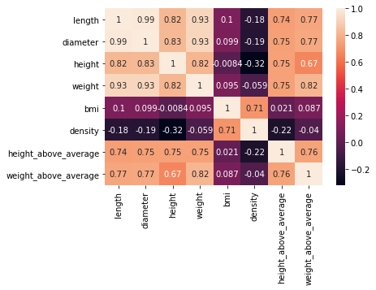
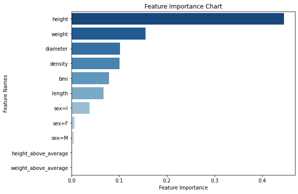
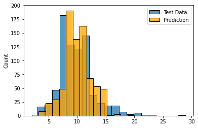
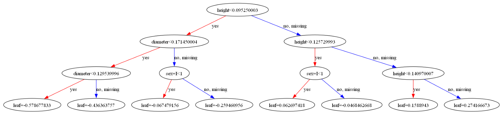

# Crab Age Prediction

## Description

Crab farming has become a lucrative business in many coastal areas due to its low labor and production costs, rapid growth, and high demand for crab consumption in various countries. However, to maximize profitability in commercial crab farming, it is crucial to know the optimal age at which crabs should be harvested. Beyond a certain age, crabs exhibit negligible growth in their physical characteristics, and harvesting them at the right time is essential to reduce costs and increase profits.

Background:

Crab farming offers significant economic opportunities for coastal communities and provides an alternative to shrimp farming. This industry's success hinges on proper care and management practices, which include determining the optimal age for crab harvesting. Harvesting too early might lead to smaller-sized crabs, while delaying the harvest could result in increased feed and maintenance costs without significant growth benefits.

Key Objectives:

The primary goal of this machine learning prediction problem is to develop a predictive model that can assist commercial crab farmers in determining the optimal age at which to harvest their crabs. The specific objectives include:

1. Predicting the age at which crabs reach their maximum growth potential.

2. Minimizing the cost associated with unnecessary feeding and maintenance beyond the optimal harvest age.

3. Maximizing the profit for crab farming businesses by timing the harvest appropriately.

The raw data can be downloaded at: [Crab Data](https://github.com/danietakeshi/ml-zoomcamp-project-1/blob/main/data/CrabAgePrediction.csv)

The original dataset has the below information:
- **sex**: Gender of the Crab - Male, Female and Indeterminate.
- **length**: Length of the Crab (in Feet; 1 foot = 30.48 cms)
- **diameter**: Diameter of the Crab (in Feet; 1 foot = 30.48 cms)
- **height**: Height of the Crab (in Feet; 1 foot = 30.48 cms)
- **weight**: Weight of the Crab (in ounces; 1 Pound = 16 ounces)
- **shucked_weight**: Weight without the shell (in ounces; 1 Pound = 16 ounces)
- **viscera_weight**: is weight that wraps around your abdominal organs deep inside body (in ounces; 1 Pound = 16 ounces)
- **shell_weight**: Weight of the Shell (in ounces; 1 Pound = 16 ounces)
- **age**: Age of the Crab (in months)

## EDA

Here are some insights extracted from the data regarding the age, length, and weight of crabs:

1. **Age:**
   - The age of the crabs in the dataset ranges from a minimum of 1 month to a maximum of 29 months.
   - The majority of crabs fall within the range of 8 to 11 months (25th percentile to 75th percentile), with a median age of 10 months.
   - The average age of the crabs in the dataset is approximately 9.95 months.
   - Age exhibits a relatively low standard deviation (approximately 3.22), suggesting that the age distribution is somewhat concentrated around the mean.

2. **Length:**
   - The length of the crabs ranges from a minimum of approximately 0.1875 feets to a maximum of approximately 2.0375 feets.
   - The majority of crabs have a length between 1.125 and 1.5375 feets, with a median length of approximately 1.3625 feets.
   - The average length of the crabs in the dataset is approximately 1.31 feets.
   - Length also exhibits a relatively low standard deviation (approximately 0.30), indicating that the length distribution is not very dispersed.

3. **Weight:**
   - The weight of the crabs varies significantly, with the minimum weight being approximately 0.0567 ounces and the maximum weight being approximately 80.10 ounces.
   - The majority of crabs fall within the range of 12.67 to 32.79 ounces (25th percentile to 75th percentile), with a median weight of approximately 22.79 ounces.
   - The average weight of the crabs in the dataset is approximately 23.57 ounces.
   - Weight exhibits a moderate standard deviation (approximately 13.89), indicating some variability in crab weight.

The table below shows the average length, weight and diameter per age of the crabs:
|  Age  |  Length  |  Weight  |  Diameter  |
|-------|----------|----------|------------|
|   1   | 0.187500 | 0.056699 |  0.137500  |
|   2   | 0.375000 | 0.425243 |  0.250000  |
|   3   | 0.441346 | 0.831949 |  0.324038  |
|   4   | 0.555896 | 1.707389 |  0.404953  |
|   5   | 0.710514 | 3.499574 |  0.525000  |
|   6   | 0.920954 | 7.724768 |  0.695176  |
|   7   | 1.052556 | 11.210639 |  0.802101  |
|   8   | 1.252668 | 18.431482 |  0.965865  |
|   9   | 1.365977 | 24.140153 |  1.061328  |
|  10   | 1.436518 | 28.593126 |  1.123328  |
|  11   | 1.496487 | 32.250366 |  1.175626  |
|  12   | 1.472732 | 31.110261 |  1.156300  |
|  13   | 1.443590 | 30.255313 |  1.138397  |
|  14   | 1.446414 | 30.247871 |  1.142623  |
|  15   | 1.440234 | 29.667013 |  1.141797  |
|  16   | 1.466331 | 32.379016 |  1.170565  |
|  17   | 1.508565 | 35.452887 |  1.191435  |
|  18   | 1.502961 | 34.472619 |  1.188816  |
|  19   | 1.493145 | 33.234759 |  1.179839  |
|  20   | 1.492391 | 34.429851 |  1.194022  |
|  21   | 1.545536 | 35.454087 |  1.213393  |
|  22   | 1.487500 | 34.621827 |  1.181250  |
|  23   | 1.482143 | 34.385919 |  1.180357  |
|  24   | 1.737500 | 50.993663 |  1.350000  |
|  25   | 1.612500 | 39.859397 |  1.225000  |
|  26   | 1.500000 | 29.979596 |  1.237500  |
|  27   | 1.518750 | 48.137451 |  1.250000  |
|  29   | 1.750000 | 51.241721 |  1.462500  |

From the information above we decided that the optimal age to harvest a crab is 11 months.

## Model Training

The data was splitted into a train/validation/test split with a 60%/20%/20% ratio.

The first model was a Logistic Regression with a C of 0.01 that resulted on a RMSE of 10.46.

After that I tried a Decision Tree Model with a max depth of 3 that yielded a RMSE of 2.59.

A Random Forest Model was applied with a max depth of 8 and 100 estimators, with a RMSE of 2.56, from this model we created the feature importance graphic below:

The final model was a XGBoost that resulted on a RMSE of 1.64 on the validation data and 2.55 on the test data with a ETA of 0.1 and a Max Depth of 3.

## Exporting to a Script

The final model was exported to a python file ([train](./code/train.py)), the code does the following: 

1. Importing Libraries:
   - `pandas` is imported to work with data in dataframes.
   - `numpy` is imported for numerical operations.
   - `pickle` is imported to save the trained model and associated objects.
   - `train_test_split` from `sklearn.model_selection` is imported to split the data into training and testing sets.
   - `DictVectorizer` from `sklearn.feature_extraction` is imported to transform categorical features into a numerical format.
   - `xgboost` is imported for implementing the XGBoost regression model.

2. `rmse` Function:
   - This function calculates the root mean squared error (RMSE) between the true target values (`y`) and predicted values (`y_pred`).

3. Setting Hyperparameters:
   - `eta` and `max_depth` are hyperparameters for the XGBoost model, controlling the learning rate and maximum depth of trees.

4. Loading Data:
   - The script loads the crab age prediction dataset from a CSV file named "CrabAgePrediction.csv" and stores it in a pandas DataFrame called `df`.

5. Formatting Data:
   - Column names are standardized by converting them to lowercase and replacing spaces with underscores.
   - Rows with a height value of 0 are removed from the dataset.
   - Various data transformations are applied, such as converting units and calculating additional features like BMI and density.

6. Feature Engineering:
   - Two binary features, 'height_above_average' and 'weight_above_average', are added to indicate whether a crab's height or weight is above the mean, respectively.

7. Train-Test Split:
   - The data is split into training and testing sets using `train_test_split`. 80% of the data is used for training (`df_full_train`), and 20% is used for testing (`df_test`).

8. Feature Encoding:
   - The categorical features in the columns variable are transformed into a numerical format using `DictVectorizer`. This is used to convert the data into a format suitable for training the XGBoost model.

9. XGBoost Data Preparation:
   - The training and testing data are converted into XGBoost's `DMatrix` format, and feature names are obtained.

10. XGBoost Parameters:
   - The parameters for the XGBoost model are set, including `eta`, `max_depth`, `min_child_weight`, `objective`, and other parameters.

11. Model Training:
   - The XGBoost model is trained on the training data (`dtrain`) with the specified parameters. The model is trained for 100 boosting rounds.

12. Model Evaluation:
   - Predictions are made on the test data, and the RMSE between the true and predicted ages is calculated as a measure of the model's performance.

13. Saving the Model:
   - The trained model, along with the `DictVectorizer` object and feature names, is saved to a binary file with a filename that includes hyperparameter values and the RMSE score.

## Flask API

The code ([predict](./code/predict.py)) sets up a Flask web service for predicting the age of crabs and determining whether they are ready for harvest. It uses a pre-trained XGBoost regression model loaded from a binary file.

1. **Loading Pre-trained Model:**
   - The code loads a pre-trained XGBoost model, a `DictVectorizer`, and feature names from a binary file.

2. **Flask Application Setup:**
   - It creates a Flask application named 'churn' for handling HTTP requests.

3. **Prediction Endpoint ('/predict'):**
   - The `/predict` route is defined to receive POST requests with crab information.

4. **Making Predictions:**
   - The code transforms the received crab data, prepares it for XGBoost, and uses the model to predict the crab's age. It also determines if the crab is ready for harvest based on the predicted age.

5. **JSON Response:**
   - A JSON response is generated, containing the predicted crab age and a 'harvest' flag.

6. **Server Startup:**
   - The Flask application is started with debugging enabled, listening on all available network interfaces at port 9696.
